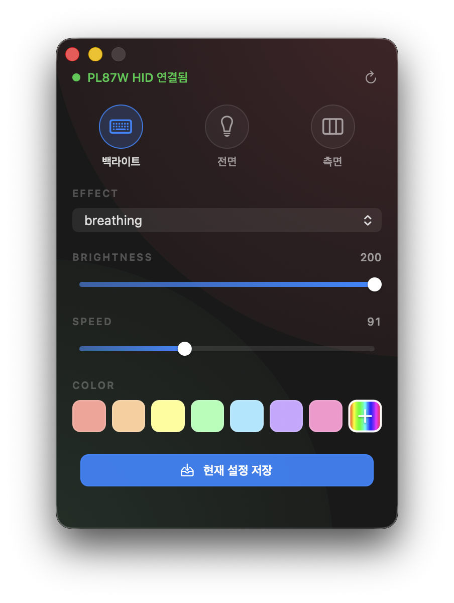
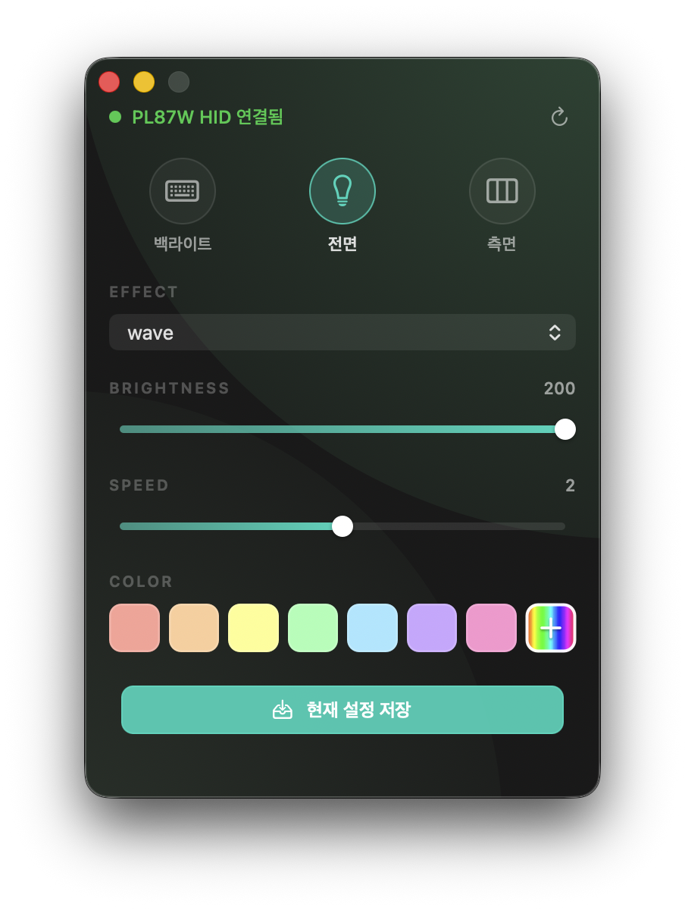
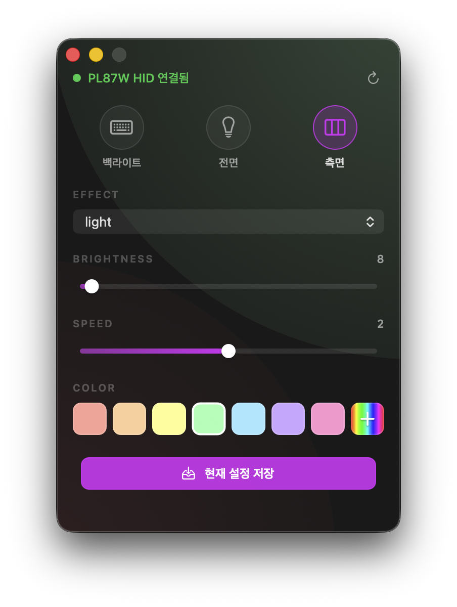
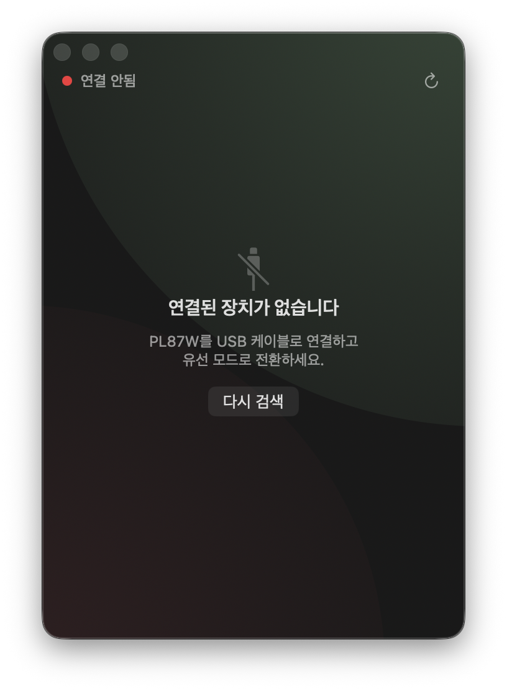

# PL87W LED Control

SPM PL87W 키보드를 USB 유선 연결에서 VIA Raw HID 로 직접 제어하는 macOS 앱.

세 가지 LED 채널(백라이트 / 전면 인디케이터 / 측면 라이트)의 효과, 밝기, 속도,
색상을 한 화면에서 조정하고 설정을 키보드 비휘발성 메모리에 저장한다.

## 미리보기

| 백라이트 | 전면 인디케이터 | 측면 라이트 | 디스커넥트 상태 |
|:---:|:---:|:---:|:---:|
|  |  |  |  |

채널마다 강조 색상(파랑·민트·보라)이 슬라이더·저장 버튼·배경 글로우에 자동 반영된다.
USB 가 분리되면 화면이 자동으로 디스커넥트 상태로 전환된다.

## 설치 (배포본)

[Releases](../../releases) 페이지에서 `PL87W_LED_Control.dmg` 를 받아 마운트한 뒤,
`PL87W LED Control.app` 을 `Applications` 폴더로 드래그해 넣으면 끝.

처음 실행 시 macOS Gatekeeper 가 "확인되지 않은 개발자" 경고를 띄울 수 있다.
이 앱은 코드 서명이 없으므로 Finder 에서 앱을 우클릭 → "열기" 로 한 번 우회하면
이후엔 더블 클릭으로 실행 가능.

요구사항:
- macOS 13 (Ventura) 이상
- USB 유선 연결 (Bluetooth 모드에서는 LED 제어용 Raw HID 가 노출되지 않음)

## 사용법

1. **연결**: PL87W 를 USB 케이블로 컴퓨터에 연결하고 키보드 후면 스위치를 유선 모드로
   전환한다. 앱을 실행하면 자동으로 디바이스를 인식해 상단에 `● PL87W HID 연결됨` 이
   표시된다. (USB 가 안 잡히면 `● 연결 안됨` + 디스커넥트 안내 화면으로 전환)

2. **채널 선택**: 상단의 동그란 탭 3 개로 제어할 채널을 고른다.
   - **백라이트** — 키캡 RGB 매트릭스 (46 종 효과)
   - **전면** — 전면 인디케이터 LED (7 종 효과: none / wave / fixed wave / spectrum / breathe / light / shutdown)
   - **측면** — 측면 라이트 LED (전면과 동일한 7 종 효과)

3. **각 채널에서 조정 가능한 항목**:
   - **EFFECT** — 드롭다운에서 효과를 선택. 즉시 키보드에 반영.
   - **BRIGHTNESS** — 슬라이더를 드래그해 밝기 조절. 핸들을 떼는 순간 전송.
   - **SPEED** — 효과 애니메이션 속도. 드래그-릴리즈 패턴 동일.
   - **COLOR** — 7 개 색상 프리셋 클릭 또는 우측 무지개 + 아이콘으로 임의 색상 선택.
     현재 적용된 색은 흰 테두리로 강조된다.

4. **저장**: 화면 하단의 **현재 설정 저장** 버튼을 누르면 키보드 비휘발성 메모리에
   저장되어 컴퓨터를 분리해도 그 상태가 유지된다.

5. **자동 연결 감지**: USB 를 뽑으면 즉시 디스커넥트 화면으로 전환되고, 다시 꽂으면
   자동으로 재인식된다. 사용자가 막 변경한 값을 자동 reload 가 덮어쓰지 않도록
   5 초 dirty-window 가 보호한다.

6. **새로고침**: 상단 우측 ⟳ 버튼은 디바이스 상태를 강제로 다시 읽는다.
   다른 도구로 펌웨어 값을 변경했을 때만 사용하면 된다.

7. **한도 초과 값 경고**: 다른 도구가 카탈로그 정의 범위 밖의 값을 설정해 두면
   해당 슬라이더의 라벨이 주황색으로 표시된다 (실제 값은 라벨에 그대로 노출).

## 빌드 (소스에서)

```bash
chmod +x build.sh
./build.sh
open "build/PL87W LED Control.app"
```

처음 빌드 시 `AppIcon.icns` 가 없으면 자동으로 `Sources/Tools/IconGenerator.swift`
를 컴파일·실행해 아이콘을 만든다.

배포용 DMG 가 필요하면:

```bash
chmod +x make_dmg.sh
./make_dmg.sh
# → build/PL87W_LED_Control.dmg
```

HID 진단용 보조 도구 (선택):

```bash
./probe.sh    # PL87W 의 VIA Raw HID 응답을 헥사덤프
./scan-hid.sh # 시스템의 모든 HID 디바이스 나열
```

## 아키텍처

MVVM + 단방향 데이터 흐름. AppKit 기반, 외부 의존성 0.

```
Sources/
├── AppLauncher.swift         # @main 진입점
├── AppDelegate.swift         # @MainActor binder — 윈도우 + ViewModel 옵저빙
├── Models/
│   ├── Models.swift          # Via 타입, EffectPreset, ColorPreset, ChannelCapabilities
│   └── LightingCatalog.swift # PL87W 채널 정의 (정적 데이터)
├── Services/
│   ├── LightingDevice.swift  # 디바이스 추상화 protocol  ← 새 기기 추가 진입점
│   ├── PL87WDevice.swift     # PL87W 구현 (@MainActor, async)
│   └── ViaHIDController.swift# IOKit Raw HID 래퍼 (callback → continuation)
├── ViewModels/
│   ├── Observable.swift      # Subscription RAII + `.store(in:)` 패턴
│   ├── AppViewModel.swift    # 전역 상태 + 자동 reconnect + dirty flag
│   └── ChannelViewModel.swift# 채널별 상태 + async intent
└── Views/                    # 모두 ViewModel 옵저빙으로 자동 업데이트
    ├── ChannelPanel.swift
    ├── ChannelTabView.swift
    ├── StatusBarView.swift
    ├── DisconnectedView.swift
    ├── ToastView.swift
    ├── AmbientBackgroundView.swift
    ├── GradientSlider.swift
    ├── ColorSwatch.swift
    └── AccentButton.swift
```

### 데이터 흐름

```
사용자가 슬라이더 드래그 (mouseUp)
   ↓ Intent
ChannelViewModel.setBrightness(value)  ── async ──┐
                                                  │
                                  await device.write(...)
                                                  │
                                  성공 시 Observable.value = value
                                                  ↓ didSet
                                  View 가 옵저빙 중인 listener 자동 호출
                                  → 슬라이더/라벨/배경 글로우 갱신
```

### 자동 연결 감지

`PL87WDevice` 가 별도 IOHIDManager 로 매칭/제거 callback 을 등록하고
`AsyncStream<ConnectionEvent>` 로 발사한다. USB 가 분리·재연결되면 화면이
자동으로 disconnected ↔ connected 로 전환된다. 사용자가 막 변경한 값을
자동 reload 가 덮어쓰지 않도록 5 초 dirty-window 가 보호한다.

## 다른 키보드 추가하기

`LightingDevice` protocol 만 구현하면 ViewModel/View 코드 수정 없이 새 기기를 붙일 수 있다.

```swift
@MainActor
final class MyKeyboardDevice: LightingDevice {
    let connectionEvents: AsyncStream<ConnectionEvent> = ...

    func connect() async -> Bool { ... }
    func reset() async { ... }
    func capabilities(of channel: ViaLightingChannel) async -> ChannelCapabilities? { ... }
    func read(channel: ViaLightingChannel) async -> ViaLightingState { ... }
    func loadStates(for sections: [LightingSection]) async -> [...]? { ... }
    func write(channel:value:bytes:) async -> Bool { ... }
    func save(channel:) async -> Bool { ... }
}
```

그리고 `Models/LightingCatalog.swift` 에 해당 기기의 채널·효과·강조 색을 정의해
`AppViewModel(sections: ..., device: MyKeyboardDevice())` 로 주입.

## PL87W Raw HID 참고

- Vendor ID: `0x36B0`
- Product ID: `0x3031`
- Usage Page: `0xFF60`
- Usage: `0x61`
- VIA Protocol: `0x000C`

채널 매핑 (제조사 배포 `PL87W.JSON` 의 VIA 메뉴 정의 기준):

| 채널 | raw value | 설명 |
|---|---|---|
| `rgbLight` | 2 | 전면 인디케이터 |
| `rgbMatrix` | 3 | 백라이트 |
| `sideLight` | 4 | 측면 라이트 |

전면/측면은 7 종 효과 (`none`, `wave`, `fixed wave`, `spectrum`, `breathe`, `light`,
`shutdown`), 백라이트는 46 종 QMK rgb_matrix 효과를 지원한다.

## 라이선스

MIT.
